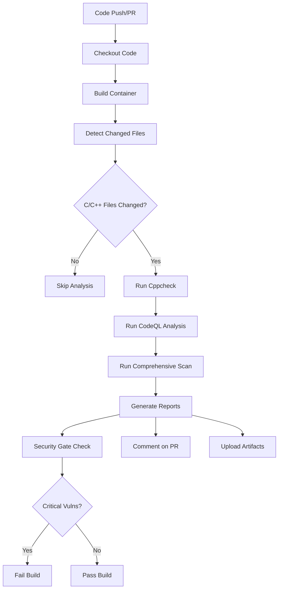

# 🔍 Auto-Scan & Detect Workflow

## Overview

This document describes the **Auto-Scan & Detect** workflow that automatically scans C/C++ code changes for security vulnerabilities using multiple static analysis tools. The workflow is designed to catch vulnerabilities early in the development process without requiring manual intervention.

## 🚀 Features

### **Automated Vulnerability Detection**
- **Multi-tool Analysis**: Combines Cppcheck and CodeQL for comprehensive coverage
- **Smart File Detection**: Only scans changed C/C++ files in PRs and pushes
- **Severity Classification**: Categorizes vulnerabilities by severity (Critical, High, Medium, Low)
- **Multiple Vulnerability Types**: Detects 8+ common vulnerability patterns

### **Intelligent Reporting**
- **GitHub Integration**: Automatic PR comments with scan results
- **Workflow Summaries**: Detailed results in GitHub Actions summary
- **Artifact Storage**: Downloadable reports for detailed analysis
- **Security Gates**: Automatic build failure on critical vulnerabilities

### **Developer-Friendly**
- **Zero Configuration**: Works out of the box with existing C/C++ projects
- **Non-Intrusive**: Only scans changed files, not entire codebase
- **Clear Guidance**: Actionable feedback on detected issues

## 📋 Workflow Architecture



## 🔧 Setup Instructions

### **1. Add Workflow File**

The workflow is defined in `.github/workflows/auto-scan-repair.yml`. It will automatically trigger on:
- Pushes to `main` and `develop` branches
- Pull requests to `main` branch
- Manual workflow dispatch

### **2. Required Permissions**

The workflow needs these GitHub permissions (already configured):
```yaml
permissions:
  contents: read          # Read repository content
  pull-requests: write    # Comment on PRs
  security-events: write  # Upload security findings
```

### **3. No Additional Setup Required**

The workflow is **zero-configuration** and will work immediately with any C/C++ project.

## 📊 Vulnerability Detection Capabilities

| **Vulnerability Type** | **CWE** | **Severity** | **Detection Method** |
|------------------------|---------|--------------|---------------------|
| Buffer Overflow | CWE-120, CWE-121, CWE-122 | High | Pattern + Semantic |
| Format String | CWE-134 | Medium | Pattern Matching |
| Memory Leak | CWE-401 | Medium | Static Analysis |
| Null Pointer Dereference | CWE-476 | High | Semantic Analysis |
| Use After Free | CWE-416 | High | Flow Analysis |
| Integer Overflow | CWE-190 | Medium | Range Analysis |
| Uninitialized Variable | CWE-457 | Low | Data Flow |
| Resource Leak | CWE-404 | Medium | Resource Tracking |

## 🔍 How It Works

### **Step 1: Change Detection**
```bash
# Automatically detects changed C/C++ files
git diff --name-only $BASE_SHA HEAD -- '*.c' '*.cpp' '*.h' '*.hpp'
```

### **Step 2: Multi-Tool Analysis**
1. **Cppcheck**: Fast static analysis for common issues
2. **CodeQL**: Deep semantic analysis for security vulnerabilities
3. **Classification Engine**: Categorizes and prioritizes findings

### **Step 3: Intelligent Reporting**
- Generates JSON reports with detailed vulnerability information
- Creates GitHub PR comments with actionable feedback
- Uploads artifacts for detailed analysis

### **Step 4: Security Gate**
- **FAIL BUILD**: If critical vulnerabilities are detected
- **WARN**: If high severity vulnerabilities exceed threshold (3)
- **PASS**: For medium/low severity issues only

## 📈 Sample Workflow Output

### **PR Comment Example**
```markdown
## 🔍 Vulnerability Scan Results

### 📊 Detection Summary
- **Total vulnerabilities**: 5
- **Critical**: 0
- **High**: 2
- **Medium**: 2
- **Low**: 1

### 🔍 Vulnerability Types Found
- **BUFFER OVERFLOW**: 2
- **FORMAT STRING**: 1
- **MEMORY LEAK**: 1
- **UNINITIALIZED VARIABLE**: 1

### 🛠️ Analysis Tools
- **cppcheck**: 3 issues
- **codeql**: 2 issues

### ⚠️ Action Required
This PR introduces **2 critical/high severity vulnerabilities**.
Please review and fix these issues before merging.
```

### **Workflow Summary**
The GitHub Actions summary shows:
- Total vulnerabilities by severity
- Vulnerability types detected
- Tools used and their findings
- Security gate status

## 🛠️ Testing the Workflow

### **Local Testing**
```bash
# Test the scanning functionality locally
./test_auto_scan.sh
```

### **Triggering the Workflow**
1. **Push Changes**: Any push to main/develop triggers scan
2. **Create PR**: Opening a PR triggers scan of changed files
3. **Manual Trigger**: Use "Run workflow" in GitHub Actions

## 📋 Interpreting Results

### **Severity Levels**
- **Critical**: Immediate security risk, build fails
- **High**: Serious security issue, should be fixed
- **Medium**: Moderate risk, fix when convenient
- **Low**: Minor issue, informational

### **Common Vulnerability Patterns**
```cpp
// Buffer Overflow (High Severity)
char buffer[10];
strcpy(buffer, user_input);  // ❌ Detected

// Format String (Medium Severity)
printf(user_input);  // ❌ Detected

// Memory Leak (Medium Severity)
char* ptr = malloc(100);
// Missing free(ptr)  // ❌ Detected
```

## 🔧 Customization Options

### **Adjusting Security Gate Thresholds**
Edit the workflow file to change when builds fail:
```yaml
# Current: Fail on any critical, warn on >3 high
if [ "$CRITICAL" -gt 0 ]; then
  exit 1  # Fail build
elif [ "$HIGH" -gt 3 ]; then
  echo "Warning"  # Just warn
fi
```

### **Adding File Extensions**
To scan additional file types, modify:
```bash
git diff --name-only $BASE_SHA HEAD -- '*.c' '*.cpp' '*.cc' '*.cxx' '*.h' '*.hpp'
```

### **Excluding Directories**
Add exclusion patterns:
```bash
git diff --name-only $BASE_SHA HEAD -- '*.cpp' ':!vendor/' ':!third_party/'
```

## 📊 Monitoring and Analytics

### **Workflow Artifacts**
Each run generates downloadable artifacts:
- `vulnerability-report-TIMESTAMP.json`: Detailed findings
- `cppcheck-results.xml`: Cppcheck raw output
- `codeql-report-TIMESTAMP.sarif`: CodeQL findings

### **GitHub Security Tab**
CodeQL results are automatically uploaded to GitHub's Security tab for tracking.

## 🚨 Troubleshooting

### **No Vulnerabilities Detected**
- ✅ **Good**: Your code is clean!
- ⚠️ **Check**: Ensure C/C++ files were actually changed
- 🔍 **Debug**: Review workflow logs for analysis errors

### **Build Failing on Critical Vulnerabilities**
1. Review the detailed vulnerability report
2. Fix the critical issues in your code
3. Push the fixes to re-trigger the scan
4. Build will pass once critical issues are resolved

### **Workflow Not Triggering**
- Ensure the workflow file is in `.github/workflows/`
- Check that you're pushing to `main` or `develop`
- Verify GitHub Actions are enabled for your repository

## 🎯 Best Practices

### **For Developers**
1. **Review Scan Results**: Always check PR comments for vulnerabilities
2. **Fix Critical Issues**: Address critical/high severity issues immediately
3. **Understand Patterns**: Learn from detected vulnerabilities to avoid them

### **For Teams**
1. **Set Standards**: Establish team policies for vulnerability handling
2. **Regular Reviews**: Periodically review and update security thresholds
3. **Training**: Use scan results as learning opportunities

## 🔄 Future Enhancements

This auto-scan workflow is designed to be the foundation for future enhancements:

1. **Auto-Repair Module**: Automatic fixing of detected vulnerabilities
2. **ML-Based Detection**: Machine learning for better accuracy
3. **Custom Rules**: Project-specific vulnerability patterns
4. **Integration**: Connect with other security tools and platforms

## 📞 Support

If you encounter issues with the auto-scan workflow:
1. Check the workflow logs in GitHub Actions
2. Review the troubleshooting section above
3. Run the local test script: `./test_auto_scan.sh`
4. Examine the generated artifacts for detailed information

---

**The Auto-Scan & Detect workflow provides automated, intelligent vulnerability detection for C/C++ projects with zero configuration required. It's designed to catch security issues early while being developer-friendly and non-intrusive.**
