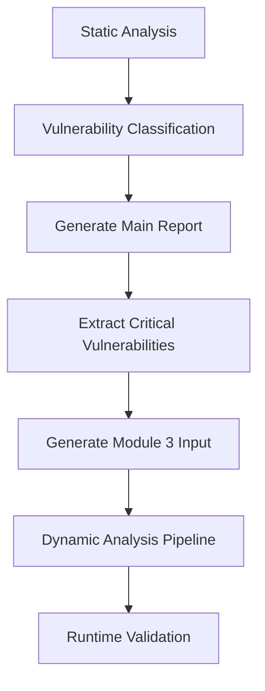

# 🚨 Critical Vulnerabilities Extraction for Module 3

## Overview

The AutoVulRepair system automatically extracts **critical vulnerabilities** from static analysis results and generates a specialized file for **Module 3 (Dynamic Analysis)**. This ensures that the most dangerous security issues are prioritized for runtime testing and validation.

## 🎯 Purpose

When static analysis detects critical vulnerabilities, the system:
1. **Extracts** only critical-severity findings
2. **Prioritizes** them for dynamic analysis
3. **Generates** targeted test cases and suggestions
4. **Prepares** input files for Module 3 pipeline

## 📁 Generated Files

### **Main Vulnerability Report**
- `vulnerability-report-TIMESTAMP.json` - Complete scan results
- Contains all vulnerabilities (critical, high, medium, low)
- Used for general reporting and security gates

### **Critical Vulnerabilities File** ⭐
- `critical-vulnerabilities-TIMESTAMP.json` - **Module 3 input**
- Contains **only critical-severity** vulnerabilities
- Includes dynamic analysis targets and suggestions
- **Ready for Module 3 consumption**

## 🔍 File Structure

### Critical Vulnerabilities File Format

```json
{
  "metadata": {
    "generated_at": "2024-10-07T21:30:00Z",
    "total_critical": 5,
    "purpose": "Input for Module 3 - Dynamic Analysis",
    "source_report": "vulnerability-report-20241007-213000.json",
    "module": "Critical Vulnerability Extraction",
    "version": "1.0"
  },
  "critical_vulnerabilities": [
    {
      "id": "cppcheck-bufferAccessOutOfBounds-45",
      "type": "buffer_overflow",
      "severity": "critical",
      "file_path": "src/vulnerable.cpp",
      "line": 45,
      "column": 12,
      "message": "Buffer access out of bounds",
      "cwe_id": "CWE-120",
      "tool": "cppcheck",
      "rule_id": "bufferAccessOutOfBounds",
      "description": "Buffer overflow vulnerability detected",
      "priority_score": 10
    }
  ],
  "dynamic_analysis_targets": {
    "files_to_analyze": ["src/vulnerable.cpp", "src/unsafe.cpp"],
    "functions_to_test": [],
    "test_cases_needed": [
      "Test src/vulnerable.cpp:45 with oversized input",
      "Boundary testing for buffer at src/vulnerable.cpp:45"
    ],
    "analysis_suggestions": [
      "Use fuzzing tools (AFL, libFuzzer) to test buffer boundaries",
      "Use AddressSanitizer (ASan) for use-after-free detection"
    ]
  }
}
```

## 🛠️ How It Works

### **Automatic Generation**
1. **Static analysis** runs (Cppcheck + CodeQL)
2. **Classification** identifies critical vulnerabilities
3. **Extraction** filters critical-only findings
4. **Enhancement** adds dynamic analysis metadata
5. **Output** generates Module 3 input file

### **Priority Scoring**
Critical vulnerabilities are scored 1-10 based on:
- **Base Score**: 10 (all critical start at highest)
- **Type Adjustment**: Buffer overflow, use-after-free, null pointer = 10
- **Other Critical Types**: Score 9

### **Dynamic Analysis Suggestions**
The system generates specific recommendations:

| **Vulnerability Type** | **Suggested Tools** | **Test Cases** |
|----------------------|-------------------|----------------|
| Buffer Overflow | AFL, libFuzzer | Oversized inputs, boundary testing |
| Null Pointer Dereference | Valgrind, AddressSanitizer | NULL inputs, allocation failures |
| Use After Free | AddressSanitizer (ASan) | Memory access patterns, double-free |

## 📊 Usage Examples

### **Manual Generation**
```bash
# Generate critical file from existing report
python3 generate_critical_report.py artifacts/vulnerability-report-20241007-210000.json

# Specify output directory
python3 generate_critical_report.py artifacts/vulnerability-report-20241007-210000.json /path/to/output
```

### **Automatic Generation**
```bash
# Runs automatically during static analysis
docker run --rm \
  -v $(pwd)/artifacts:/app/artifacts \
  -v $(pwd)/src:/app/src \
  autovulrepair:latest \
  /app/pipeline/static_scan.sh /app/src

# Check for critical file
ls artifacts/critical-vulnerabilities-*.json
```

### **GitHub Actions Integration**
The workflow automatically:
1. Runs static analysis
2. Generates critical vulnerabilities file
3. Uploads as artifact
4. Reports in PR comments and summaries

## 🎯 Module 3 Integration

### **Input for Dynamic Analysis**
The critical vulnerabilities file provides:
- **Target files** to focus testing on
- **Specific line numbers** with critical issues
- **Vulnerability types** for tool selection
- **Test case suggestions** for comprehensive coverage

### **Example Module 3 Usage**
```python
# Module 3 can consume the critical file
import json

with open('artifacts/critical-vulnerabilities-20241007-210000.json') as f:
    critical_data = json.load(f)

# Get files to analyze
target_files = critical_data['dynamic_analysis_targets']['files_to_analyze']

# Get test suggestions
test_cases = critical_data['dynamic_analysis_targets']['test_cases_needed']

# Run dynamic analysis on critical targets
for vuln in critical_data['critical_vulnerabilities']:
    if vuln['type'] == 'buffer_overflow':
        run_fuzzing_test(vuln['file_path'], vuln['line'])
    elif vuln['type'] == 'use_after_free':
        run_asan_test(vuln['file_path'], vuln['line'])
```

## 🔧 Configuration

### **Severity Threshold**
Currently extracts only **critical** severity. To modify:

```python
# In generate_critical_report.py
critical_vulns = [v for v in vulnerabilities if v.get('severity') in ['critical', 'high']]
```

### **Priority Scoring**
Adjust priority calculation in `calculate_priority_score()`:

```python
def calculate_priority_score(vulnerability):
    base_score = 10
    # Add custom logic here
    return base_score
```

## 📋 Testing

### **Test Critical Extraction**
```bash
# Run test with critical samples
./test_auto_scan.sh

# Check critical file generation
ls artifacts/critical-vulnerabilities-*.json
jq '.metadata.total_critical' artifacts/critical-vulnerabilities-*.json
```

### **Validate Module 3 Readiness**
```bash
# Verify file structure
jq '.dynamic_analysis_targets.files_to_analyze' artifacts/critical-vulnerabilities-*.json

# Check test suggestions
jq '.dynamic_analysis_targets.analysis_suggestions' artifacts/critical-vulnerabilities-*.json
```

## 🚀 Benefits

1. **Focused Analysis**: Module 3 only processes critical issues
2. **Efficient Resource Usage**: No time wasted on low-priority items
3. **Targeted Testing**: Specific test cases for each vulnerability type
4. **Tool Recommendations**: Suggests best tools for each issue type
5. **Automated Pipeline**: Seamless integration between modules

## 📈 Workflow Integration



## 🎯 Next Steps

1. **Module 3 Development**: Use critical file as input
2. **Tool Integration**: Connect with fuzzing and runtime analysis tools
3. **Validation Pipeline**: Verify fixes resolve critical issues
4. **Reporting**: Combine static + dynamic results

---

**The critical vulnerabilities extraction ensures that Module 3 focuses on the most dangerous security issues, making the overall pipeline more efficient and effective.**
